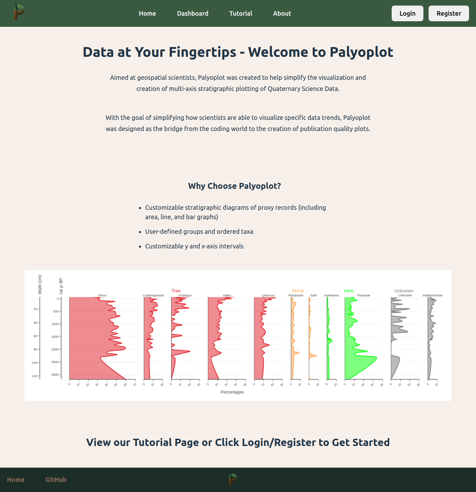
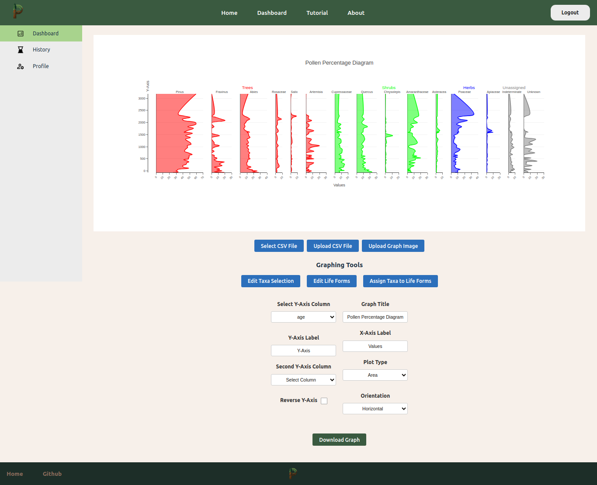
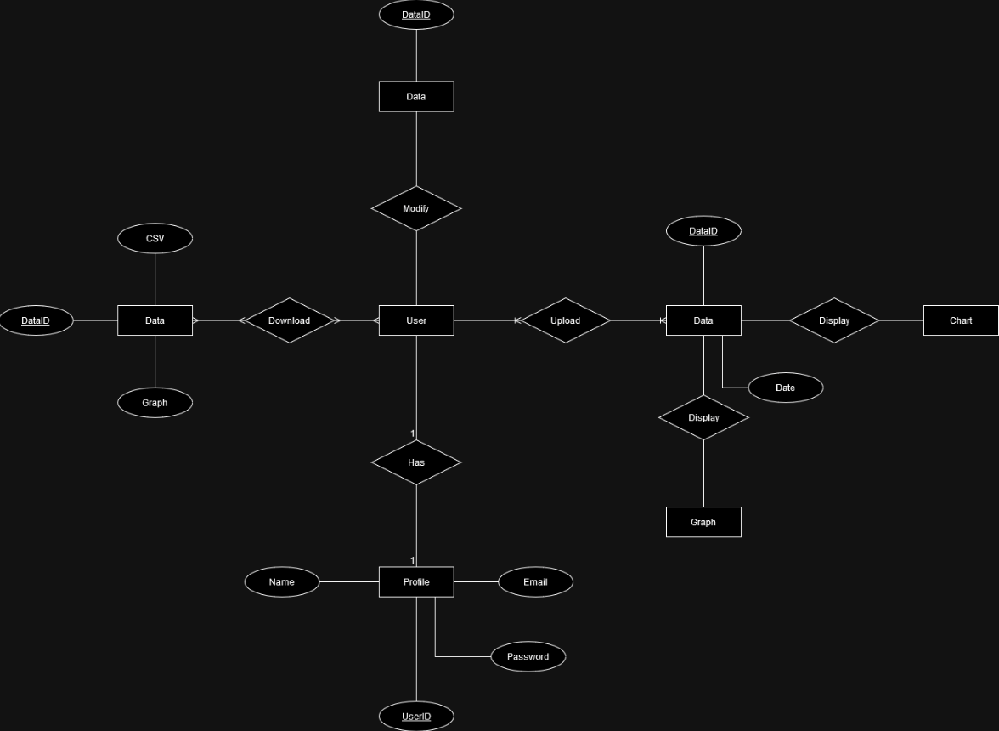

<h1 align="center">Palyoplot - Team Techies</h1>

### Contributors
- Joshua Hicks: jahicks@csus.edu
- Nicholas Sanchez: nksanchez2@csus.edu
- Tony Tran: tonytran4@csus.edu
- Phu Duong: phuduong@csus.edu
- Penny Herrera: pennyherrera@csus.edu
- Ryan Desagun: ryandesagun@csus.edu
- Hamzah Alazzeh: hamzahalazzeh@csus.edu
- Michael Berbach: mberbach@csus.edu

### Table of Contents
- [About the Project](#about-the-project)
  - [Images](#images)
  - [ERD](#erd) 
- [Getting Started](#getting-started)
  - [Dependencies](#dependencies)
  - [Deployment](#deployment)
  - [Testing](#testing)
  - [Developer Instructions](#developer-instructions)
- [Sprint Timeline](#sprint-timeline)
- [Acknowledgements & Resources](#acknowledgements--resources)

## About the Project 
### Synopsis
Palyoplot is a web-based application originally developed as an R package by Dr. Anna Klimaszewski-Patterson, an Associate Professor and the Geospatial Centroid Director at CSU Sacramento. Palyoplot facilitates the creation of high-quality stratigraphic diagrams for publications. This tool leverages a modern LAMP tech stack, with a front-end powered by React Vite, and employ data management features to facilitate privacy and reusability. By simplifying the visualization process, Palyoplot aims to lower barriers to entry, enhance research capabilities, and foster community collaboration by making complex data sets accessible and understandable without the need for advanced skills in programming or graphics.
### Images

### ERD

## Getting Started
### Dependencies
### Deployment
### Testing
### Developer Instructions

### Sprint 5 (08/26/24 - 9/9/24)

1. map logic of R-package to draft back-end graph tool
2. confirm minimum viable feature set, generated assets file type
3. design DB for account management
4. Confirm speed/data limits with IRT

### Sprint 6 (9/9/24 - 9/23/24)

1. Implement DB design for account management, authentication
2. develop style-sheet/parameter setting back-end for tool
3. add style-sheet/parameter interface to UI
4. Workable back-end graph tool using example data, style-sheet not necessary (aka default mode)

### Sprint 7 (9/23/24 - 10/7/24)

1. Full confirmed feature set added to UI
2. Connect graph-tool to UI, default mode
3. associate account management features to style-sheet/parameter settings
4. Graph tool using style sheets completed
5. outline remote test server capabilities and limitations

### Sprint 8 (10/7/24 - 10/21/24)

1. Team has access to remote testing environment
2. Test migration of user login/authentication/management
3. style-sheet adjustable through UI
4. tool fully implements style sheet

### Sprint 9 (10/21/24 - 11/4/24)

1. Test upload/download capabilities and data caps
2. Web-tool remote deployment complete
3. Bug testing

## Acknowledgements & Resources
