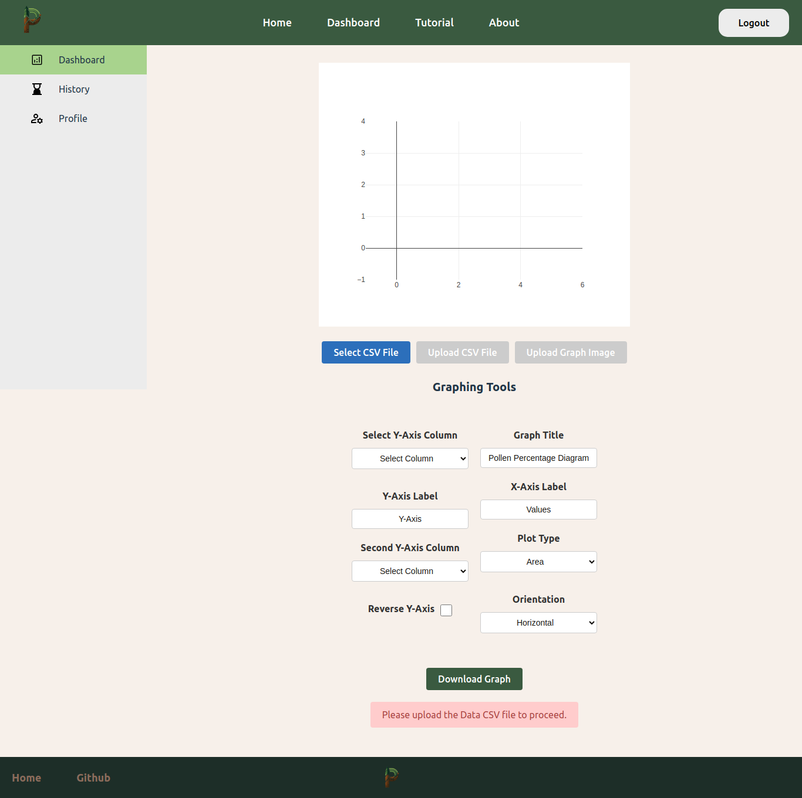

<h1 align="center">Palyoplot - Team Techies</h1>
<p align="center">


</p>

### Contributors
- Joshua Hicks: jahicks@csus.edu
- Nicholas Sanchez: nksanchez2@csus.edu
- Tony Tran: tonytran4@csus.edu
- Phu Duong: phuduong@csus.edu
- Penny Herrera: pennyherrera@csus.edu
- Ryan Desagun: ryandesagun@csus.edu
- Hamzah Alazzeh: hamzahalazzeh@csus.edu
- Michael Berbach: mberbach@csus.edu

### Table of Contents
- [About the Project](#about-the-project)
  - [Images](#images)
  - [ERD](#erd) 
- [Getting Started](#getting-started)
  - [Dependencies](#dependencies)
  - [Deployment](#deployment)
  - [Testing](#testing)
  - [Developer Instructions](#developer-instructions)
- [Sprint Timeline](#sprint-timeline)
- [Acknowledgements & Resources](#acknowledgements--resources)

## About the Project 
### Synopsis
Palyoplot is a web-based application originally developed as an R package by Dr. Anna Klimaszewski-Patterson, an Associate Professor and the Geospatial Centroid Director at CSU Sacramento. Palyoplot facilitates the creation of high-quality stratigraphic diagrams for publications. This tool leverages a modern LAMP tech stack, with a front-end powered by React Vite, and employ data management features to facilitate privacy and reusability. By simplifying the visualization process, Palyoplot aims to lower barriers to entry, enhance research capabilities, and foster community collaboration by making complex data sets accessible and understandable without the need for advanced skills in programming or graphics.
### Images
<p align="center">
  
</p>
<p align="center">Homepage of Palyoplot with the Navigation Bar on top .</p>

<p align="center">
  
</p>
<p align="center">Dashboard page with the graphing tool implemented using Plotly. Upload CSV file to create a graph with different customization tools.</p>

<p align="center">
  
</p>
<p align="center">Graph created on the Dashboard page, including multiple Y-Axis and life form grouping.</p>

<p align="center">
  
</p>
<p align="center">History table that keeps track of created graphs and saves them to the database.</p>

### Entity-Relationship Diagram
<p align="center">
  
</p>
<p align="center">ERD of the database structure and relationship between entities.</p>

## Getting Started
Palyoplot is a web-based application that facilitates the creation of high-quality stratigraphic diagrams for publications. This guide will walk you through how to set up, deploy, and test the Palyoplot application.
### Dependencies
The Palyoplot application relies on several system-level and application-level dependencies:

System-Level Dependencies
Python 3 and Pip: Required for running Django.
MariaDB Server: Used to store user and application data.
Node.js and npm: Used for building and running the Vite frontend.
Apache Server and Gunicorn: For running the application in production.

### Deployment
The deployment process involves multiple stages including setting up an AWS EC2 instance, configuring the environment, and deploying both the Django backend and Vite frontend.

Launch an EC2 Instance
Login to AWS Management Console and navigate to the EC2 Dashboard.
Launch a New Instance:
Choose Ubuntu Noble 24.04 as your base AMI (Amazon Machine Image).
Select t2.medium as the instance type.
Configure networking settings such as VPC and Subnet, and enable Auto-assign Public IP.
Configure Security Groups
Set up inbound rules to allow access via:
Port 22 (SSH): Admin access.
Port 80 (HTTP) and 443 (HTTPS): Web traffic.
Port 8000: Development server.
Attach an Elastic IP
Allocate an Elastic IP in the AWS Console and associate it with your instance to ensure a static IP address that does not change upon restarts.
Connect to the Instance
Use SSH to connect:
```bash
ssh -i PalyoplotKP.pem ubuntu@<public_ip>
```
Install System-Level Dependencies
Update System Packages:

First, update the package list to ensure all packages are up to date.
```bash
sudo apt update && sudo apt upgrade -y
```
Install Python and PIP

Python 3 is required for running Django, and PIP is needed for managing Python packages.
```bash
sudo apt install python3 python3-pip -y
```
Install MariaDB Server

Install MariaDB to set up the database for the application.
```bash
sudo apt install mariadb-server -y
```
Install Git

Git is used to clone the project repository.
```bash
sudo apt install git -y
```
Install Apache2 Web Server

Apache is used as the web server and reverse proxy for the application.
```bash
sudo apt install apache2 -y
```
Install Apache Modules for Reverse Proxy

Install the necessary Apache modules to use it as a reverse proxy for Gunicorn.
```bash
sudo apt install libapache2-mod-proxy-uwsgi libapache2-mod-wsgi-py3 -y
```
Install Gunicorn

Gunicorn is the WSGI HTTP server that will be used to serve the Django application.
```bash
sudo pip3 install gunicorn
```
Install Node.js and npm

Node.js and npm are required for building and running the Vite frontend.
```bash
sudo apt install nodejs npm -y
```
Install curl for troubleshooting
```bash
sudo apt install curl
```
Set Up the Database
Install and configure MariaDB for Palyoplot:
``` bash
sudo mysql_secure_installation
sudo mysql -u root -p
CREATE DATABASE your_db_name;
CREATE USER 'your_db_user'@'localhost' IDENTIFIED BY 'your_db_password';
GRANT ALL PRIVILEGES ON your_db_name.* TO 'your_db_user'@'localhost';
FLUSH PRIVILEGES;
EXIT;
```
Deploy Django Application

Clone the Repository:
```bash
git clone https://github.com/yourusername/palyoplot.git
```
Create and Activate a Virtual Environment:
```bash
cd palyoplot
python3 -m venv venv
source venv/bin/activate
```
Apply Migrations:
```bash
python manage.py migrate
```
Set Up Environment Files

Create .env.production in the Palyoplot/myproject directory:
```bash
nano /home/ubuntu/Palyoplot/myproject/.env.production
```
Include relevant environment variables:
```plaintext
# Security and Environment Settings
DJANGO_SECRET_KEY='your_secret_key_here'
DEBUG=False
ALLOWED_HOSTS='your_public_ip,127.0.0.1,localhost'


# Database Credentials
DB_NAME='your_db_name'
DB_USER='your_db_user'
DB_PASSWORD='your_db_password'
DB_HOST='your_db_host'
DB_PORT='3306'


# URL Configuration
FRONTEND_URL='http://your_public_ip'
VITE_API_URL='http://your_public_ip/api'


# CORS Settings
CORS_ALLOWED_ORIGINS='http://your_public_ip'


# AWS SES Configuration for Emails
AWS_SES_ACCESS_KEY_ID='your_aws_access_key_id'
AWS_SES_SECRET_ACCESS_KEY='your_aws_secret_access_key'
AWS_SES_REGION_NAME='your_aws_region'
DEFAULT_FROM_EMAIL='admin@yourdomain.com'


# Additional Settings
DJANGO_ENVIRONMENT='production'
```
Create .env for Vite in the Palyoplot/vite directory:
```bash
nano /home/ubuntu/Palyoplot/vite/.env
```
Include:
```plaintext
VITE_API_URL='http://your_public_ip/api'
```
Set Up Apache and Gunicorn

Create Apache Configuration::
```bash
sudo nano /etc/apache2/sites-available/palyoplot.conf
```
Add the following configuration:
```plaintext
<VirtualHost *:80>
    ServerName your_domain_or_ip
    DocumentRoot /home/ubuntu/palyoplot/staticfiles/dist


    Alias /static /home/ubuntu/palyoplot/staticfiles
    <Directory /home/ubuntu/palyoplot/staticfiles>
        Require all granted
    </Directory>


    <Directory /home/ubuntu/palyoplot/staticfiles/dist>
        Options Indexes FollowSymLinks
        AllowOverride All
        Require all granted


        RewriteEngine On
        RewriteBase /
        RewriteCond %{REQUEST_URI} ^/admin [NC]
        RewriteRule .* - [L]
        RewriteRule ^index\.html$ - [L]
        RewriteCond %{REQUEST_FILENAME} !-f
        RewriteCond %{REQUEST_FILENAME} !-d
        RewriteRule . /index.html [L]
    </Directory>


    ProxyPreserveHost On
    ProxyPass / http://127.0.0.1:8000/
    ProxyPassReverse / http://127.0.0.1:8000/


    ErrorLog ${APACHE_LOG_DIR}/error.log
    CustomLog ${APACHE_LOG_DIR}/access.log combined
</VirtualHost>
```
Enable the new site configuration:
```bash
sudo a2ensite palyoplot
sudo systemctl restart apache2
```

Create a Systemd Service for Gunicorn
Create a service file for Gunicorn:
```bash
sudo nano /etc/systemd/system/gunicorn.service
```
Add the following:
```plaintext
[Unit]
Description=gunicorn daemon
After=network.target


[Service]
User=ubuntu
Group=www-data
WorkingDirectory=/home/ubuntu/palyoplot
ExecStart=/home/ubuntu/palyoplot/venv/bin/gunicorn --workers 3 --bind unix:/home/ubuntu/palyoplot/gunicorn.sock palyoplot.wsgi:application


[Install]
WantedBy=multi-user.target
```
Start and Enable Gunicorn
Start and enable Gunicorn:
```bash
sudo systemctl start gunicorn
sudo systemctl enable gunicorn
```
Set Up Static Files
Run python manage.py collectstatic to collect static files:
```bash
python manage.py collectstatic
```
Set Up Permissions
Set Permissions for Apache User (www-data)
To ensure that the Apache server can access all necessary files and directories:
```bash
sudo chown -R www-data:www-data /home/ubuntu/palyoplot
sudo chmod -R 755 /home/ubuntu/palyoplot
```
Navigate to Vite Directory and Install Missing Dependencies
Navigate to the Vite directory and install any missing dependencies required for the build:
```bash
cd /home/ubuntu/palyoplot/vite
npm install papaparse plotly.js-dist-min
```
Build the Frontend
Run the build command:
```bash
npm run build
```
This will create a dist directory with the production build of the Vite frontend.
Move Dist to Static Directory
Move the dist folder to the static directory so that Apache can serve it:
```bash
mv dist /home/ubuntu/palyoplot/staticfiles/
```

### Testing
#### Prerequisites
Before running the test suite, you'll need to install the following dependencies:
```bash
pip install selenium webdriver-manager unittest-xml-reporting
```
#### Additional Requirements
1. Chrome Browser: The tests use Chrome in headless mode
2. Python 3.x installed
3. A running instance of the Palyoplot web application (running on localhost:5173)
4. Test data file: Ensure `test.csv` exists in the same directory as `test_suite.py`
#### Running the Tests
1. Navigate to the project's test directory:
```bash
cd path/to/Palyoplot/
```

2. Execute the test suite:
```bash
python test_suite.py
```
#### What the Tests Cover
The test suite performs end-to-end testing of key application features:

1. Homepage Load (`test_homepage_load`): Verifies the homepage loads correctly
2. Navigation (`test_navigation`): Tests navigation bar functionality
3. Unauthorized Dashboard Access (`test_1_unauthorized_dashboard_access`): Checks redirect to login
4. Registration (`test_2_register`): Tests user registration process
5. Login and Dashboard (`test_3_login_and_dashboard`): Verifies login functionality and dashboard access
6. CSV Upload (`test_4_csv_upload`): Tests CSV file upload functionality
7. Delete History (`test_5_delete_history`): Tests deletion of uploaded files
8. Password Change (`test_6_change_password`): Tests password change functionality
#### Test Results
- Test results will be displayed in the console
- Failed tests will generate screenshots in the current directory with timestamp and failure type
- Each test provides detailed output about what's being tested and any failures encountered
#### Troubleshooting
- If tests fail due to timing issues, you may need to adjust the wait times in the test file
- Screenshots of failures are automatically saved with timestamps for debugging
- Check that your web application is running on the expected port (default: 5173)
- Ensure Chrome browser is installed and updated
- Verify the test CSV file is present and properly formatted
#### Note
The test suite uses Selenium's headless mode by default. If you need to see the browser during testing, you can modify the chrome_options in the test file by removing the '--headless=new' argument.
